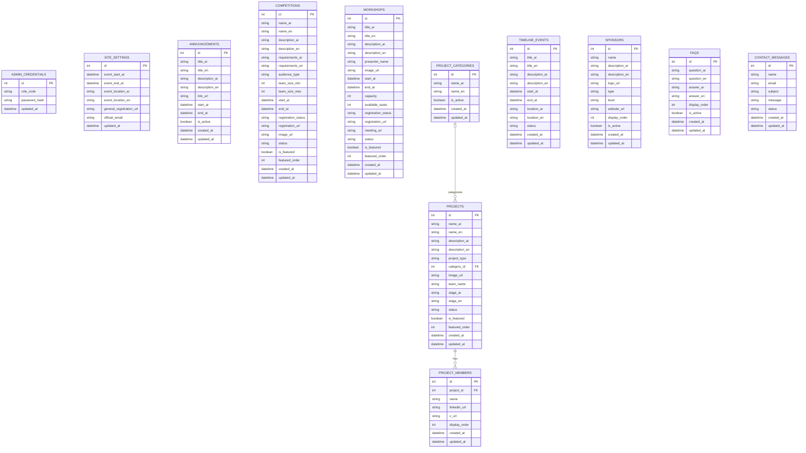

# RoboTactic Database ER Diagram

```mermaid
erDiagram

    ADMIN_CREDENTIALS {
        int id PK
        string role_code
        string password_hash
        datetime updated_at
    }

    SITE_SETTINGS {
        int id PK
        datetime event_start_at
        datetime event_end_at
        string event_location_ar
        string event_location_en
        string general_registration_url
        string official_email
        datetime updated_at
    }

    ANNOUNCEMENTS {
        int id PK
        string title_ar
        string title_en
        string description_ar
        string description_en
        string link_url
        datetime start_at
        datetime end_at
        boolean is_active
        datetime created_at
        datetime updated_at
    }

    COMPETITIONS {
        int id PK
        string name_ar
        string name_en
        string description_ar
        string description_en
        string requirements_ar
        string requirements_en
        string audience_type
        int team_size_min
        int team_size_max
        datetime start_at
        datetime end_at
        string registration_status
        string registration_url
        string image_url
        string status
        boolean is_featured
        int featured_order
        datetime created_at
        datetime updated_at
    }

    WORKSHOPS {
        int id PK
        string title_ar
        string title_en
        string description_ar
        string description_en
        string presenter_name
        string image_url
        datetime start_at
        datetime end_at
        int capacity
        int available_seats
        string registration_status
        string registration_url
        string meeting_url
        string status
        boolean is_featured
        int featured_order
        datetime created_at
        datetime updated_at
    }

    PROJECT_CATEGORIES {
        int id PK
        string name_ar
        string name_en
        boolean is_active
        datetime created_at
        datetime updated_at
    }

    PROJECTS {
        int id PK
        string name_ar
        string name_en
        string description_ar
        string description_en
        string project_type
        int category_id FK
        string image_url
        string team_name
        string stage_ar
        string stage_en
        string status
        boolean is_featured
        int featured_order
        datetime created_at
        datetime updated_at
    }

    PROJECT_MEMBERS {
        int id PK
        int project_id FK
        string name
        string linkedin_url
        string x_url
        int display_order
        datetime created_at
        datetime updated_at
    }

    TIMELINE_EVENTS {
        int id PK
        string title_ar
        string title_en
        string description_ar
        string description_en
        datetime start_at
        datetime end_at
        string location_ar
        string location_en
        string status
        datetime created_at
        datetime updated_at
    }

    SPONSORS {
        int id PK
        string name
        string description_ar
        string description_en
        string logo_url
        string type
        string level
        string website_url
        int display_order
        boolean is_active
        datetime created_at
        datetime updated_at
    }

    FAQS {
        int id PK
        string question_ar
        string question_en
        string answer_ar
        string answer_en
        int display_order
        boolean is_active
        datetime created_at
        datetime updated_at
    }

    CONTACT_MESSAGES {
        int id PK
        string name
        string email
        string subject
        string message
        string status
        datetime created_at
        datetime updated_at
    }

    PROJECT_CATEGORIES o|--o{ PROJECTS : categorizes
    PROJECTS ||--o{ PROJECT_MEMBERS : has
```